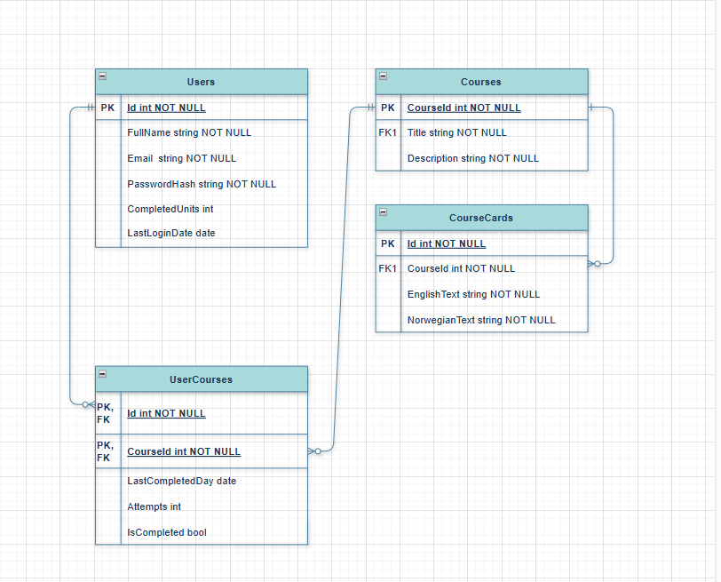

# Project Setup Instructions

## 1. Change the Default Connection String:
- Open the appsettings.json file in the API project.
- Find the DefaultConnection setting.
- Replace the default connection string with your own database connection string.

Example:
"ConnectionStrings": {
  "DefaultConnection": "Your_Connection_String_Here"
}

## 2. Change HTTP URL in Program.cs:
- Open Program.cs in the API project.
- Replace the default http://localhost:3000 (or any other address) with the correct URL that your API will be running on.

Example in Program.cs:
var builder = WebApplication.CreateBuilder(args);

// Set the URL for your API
builder.WebHost.UseUrls("http://yourapiurl:port");

var app = builder.Build();

## 3. Edit the .env file
In the root of your React project, create or edit a file named .env and add the actual URL of your backend API:

Example:
REACT_APP_API_URL=http://localhost:5117

🔁 Replace http://localhost:5117 with your actual backend URL if different.

Important:

No spaces around =

No quotes around the URL

Restart the React development server after changing .env

## 4. System Design

## 5. Schema Diagram 

